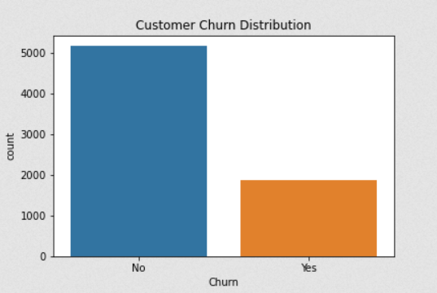
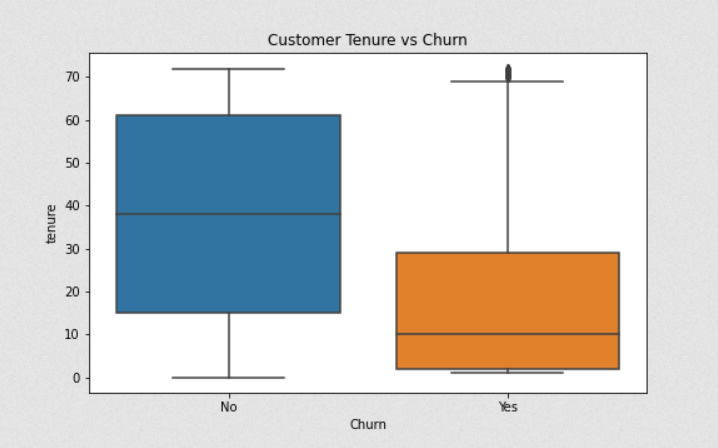

# Customer Churn Analysis using Python

## Project Overview

This project analyzes a telecom customer churn dataset to understand patterns that influence customer churn. The goal is to identify factors that lead customers to leave a service.

The analysis includes data exploration, churn distribution analysis, and visualizations to understand how contract type, monthly charges, and customer tenure affect churn.

## Tools Used

- Python
- Pandas
- NumPy
- Matplotlib
- Seaborn
- Jupyter Notebook

## Dataset

This project uses the **Telco Customer Churn dataset**, which contains customer account information and whether customers churned (left the service).

The dataset includes information such as:
- Customer tenure
- Contract type
- Monthly charges
- Total charges
- Customer demographics
- Churn status

Dataset Source:  
https://www.kaggle.com/datasets/blastchar/telco-customer-churn

## Analysis

The notebook performs several steps to explore and analyze customer churn:

1. **Data Exploration**
   - Inspect dataset structure
   - Review column types and summary statistics

2. **Churn Distribution Analysis**
   - Analyze how many customers churned vs stayed

3. **Churn by Contract Type**
   - Compare churn behavior across month-to-month, one-year, and two-year contracts

4. **Monthly Charges Analysis**
   - Examine the relationship between monthly charges and churn

5. **Customer Tenure Analysis**
   - Investigate how long customers stay before churning

Visualizations were created using **Seaborn and Matplotlib** to highlight patterns in customer behavior.

## Key Insights

The analysis revealed several important patterns related to customer churn:

- **Contract Type:** Customers with month-to-month contracts have the highest churn rate compared to customers with one-year or two-year contracts.

- **Monthly Charges:** Customers who churn tend to have higher monthly charges on average.

- **Customer Tenure:** Customers with shorter tenure are significantly more likely to churn compared to long-term customers.

These findings suggest that companies should focus on improving retention strategies for new customers and customers with month-to-month contracts.

## Visualizations

### Customer Churn Distribution

### Customer Tenure vs Churn

## Files
- **customer_churn_analysis.ipynb** – Jupyter notebook containing the full data analysis and visualizations  
- **images/churn_distribution.png** – Chart showing the distribution of customer churn  
- **images/tenure_vs_churn.png** – Visualization of customer tenure comparison between churned and retained customers
